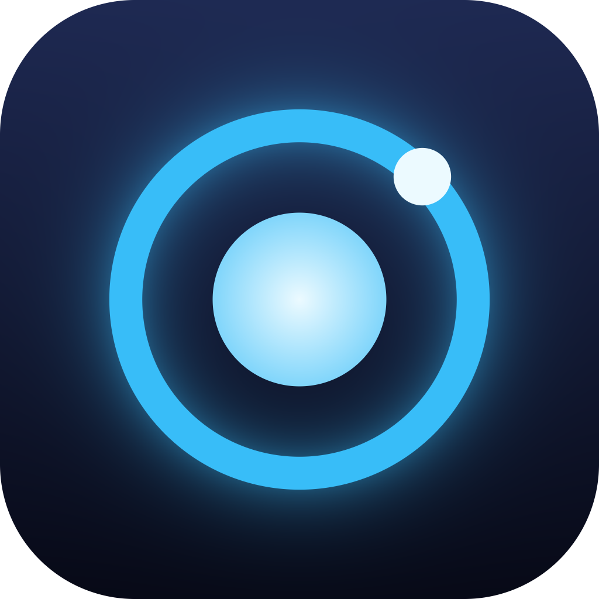

<p align="center">
  
</p>

<h1 align="center">Core Engine</h1>

<p align="center">
  A small cross-platform engine for building games and programs, written in C++17 on top of SDL3.
</p>

## Editor

`CoreEditor` is the desktop editor for Windows, Linux and macOS. It opens on a home screen and switches to the editor once a project is loaded.

- **Home screen:** recent projects, open an existing folder, and create a new project from the Empty or 2D Starter template
- **Hierarchy:** add, select, duplicate and delete entities
- **Inspector:** edit name, shape, position, size, color and velocity, or the scene name and background when nothing is selected
- **Viewport:** click to select, drag to move, and Play to simulate the scene, with Stop restoring the edited state
- **Assets:** live view of the project folder
- **Project files:** `project.core` and `scenes/main.scene`, both plain text; unsaved changes are guarded on close and quit

Shortcuts: `Ctrl+S` saves and `Del` deletes the selection.

## Platforms

| Platform | Output | Toolchain |
| --- | --- | --- |
| Windows x64 / ARM64 | `CoreEngineSandbox.exe`, `CoreEditor.exe` | Visual Studio |
| Linux x64 | `CoreEngineSandbox`, `CoreEditor` | Ninja + GCC |
| macOS universal | `CoreEngineSandbox.app`, `CoreEditor.app` | Ninja + Clang |
| Android | `app-debug.apk` | Gradle + NDK |
| iOS | unsigned `.ipa` | Xcode |

## Layout

- `engine/` engine library (`core::Application`, `Window`, `Renderer`, `Input`, `Scene`, `Entity`, `SceneData`, `Platform`)
- `editor/` home screen and editor built with Dear ImGui
- `sandbox/` sample application that runs on every platform, including mobile
- `platform/` per-platform packaging resources (Windows resource file, iOS plist and asset catalog)
- `android/` Gradle project that hosts the engine through SDL's `SDLActivity`
- `assets/icon/` application icons in PNG, ICO and ICNS
- `tools/generate-icons.mjs` regenerates every icon, including the Android mipmaps, the iOS asset catalog and the embedded window icon
- `.github/workflows/main.yml` builds, runs and packages every platform

## Mobile support

- Touch input is exposed through `Input::Touches()` and a unified pointer (`PointerDown`, `PointerPosition`) that falls back to the mouse
- Application lifecycle events call `OnPause`, `OnResume` and `OnLowMemory`
- `Window::SafeArea()` reports the notch and gesture-bar insets
- Android hardware back is delivered as `SDL_SCANCODE_AC_BACK`

## Building

Desktop:

```sh
cmake -S . -B build
cmake --build build --config Release
```

SDL3 is fetched automatically. To use a local checkout, place it in `third_party/SDL` or pass `-DCOREENGINE_SDL_DIR=<path>`.

Android:

```sh
git clone --depth 1 --branch release-3.2.10 https://github.com/libsdl-org/SDL.git third_party/SDL
cd android
gradle assembleDebug
```

iOS:

```sh
cmake -S . -B build -G Xcode -DCMAKE_SYSTEM_NAME=iOS -DCMAKE_OSX_ARCHITECTURES=arm64
cmake --build build --config Release -- -sdk iphoneos CODE_SIGNING_ALLOWED=NO
```

## Smoke test

Both the sandbox and the editor accept `--frames <n>` and exit after that many frames. The editor also accepts `--open <folder>` to open a project, creating it when it does not exist yet. CI runs both on Windows, Linux and macOS with `SDL_VIDEODRIVER=dummy` and `SDL_RENDER_DRIVER=software`.

## Minimal application

```cpp
#include "core/Application.h"
#include "core/EntryPoint.h"

class MyScene : public core::Scene {
public:
    void OnRender(core::Application& app, core::Renderer& renderer) override {
        renderer.FillCircle(renderer.OutputSize() * 0.5f, 64.0f, {56, 189, 248, 255});
        core::Scene::OnRender(app, renderer);
    }
};

int main(int, char**) {
    core::Application app;
    app.SetScene<MyScene>();
    return app.Run();
}
```
